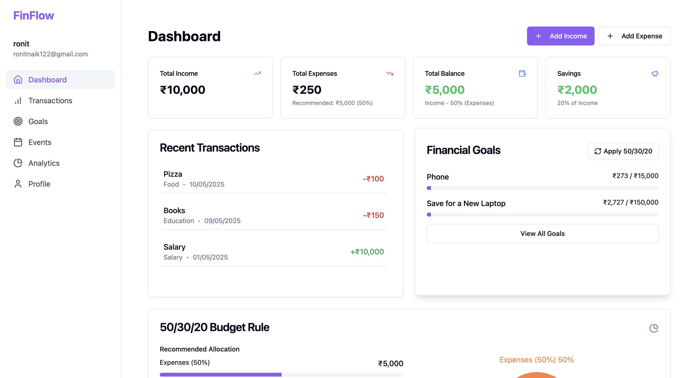
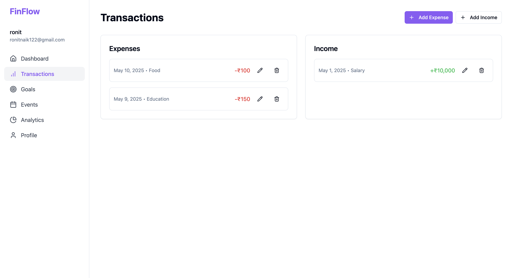
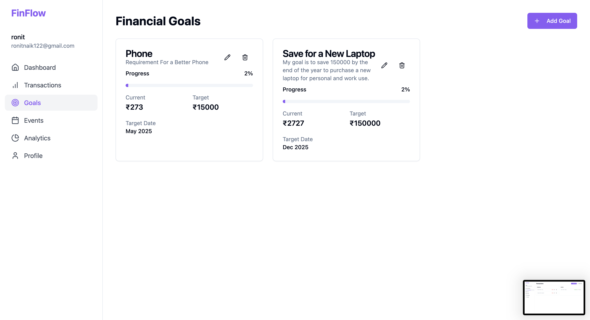
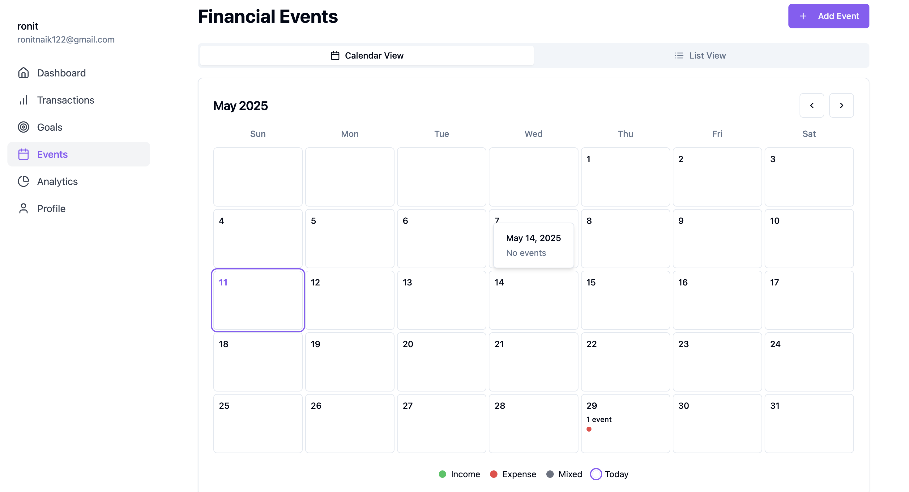
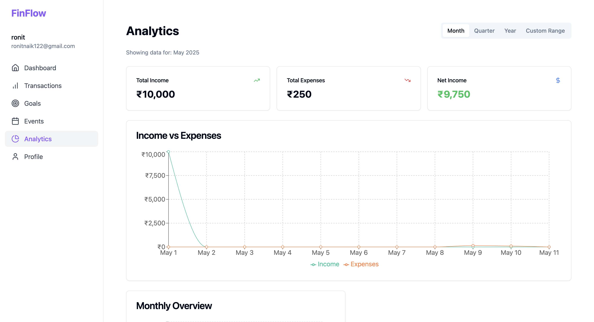
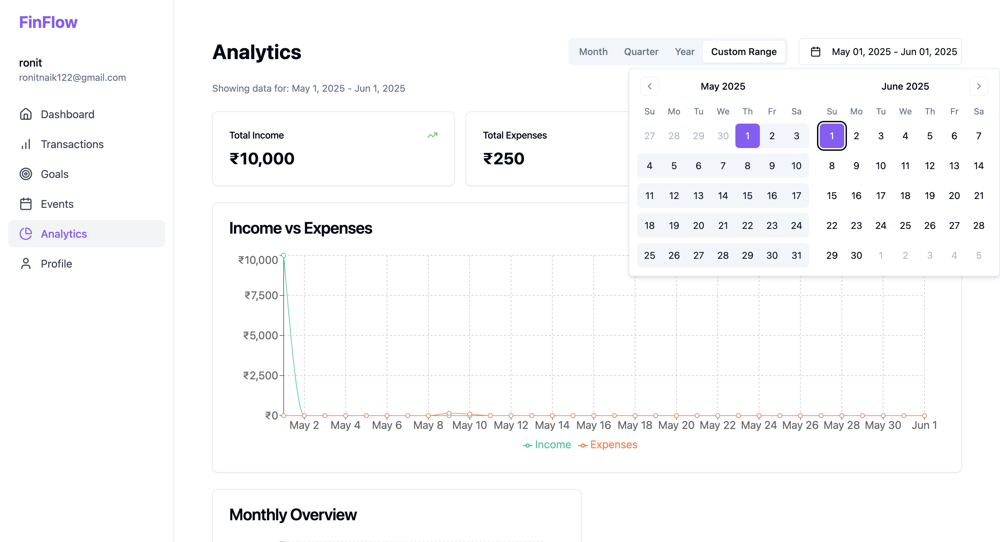
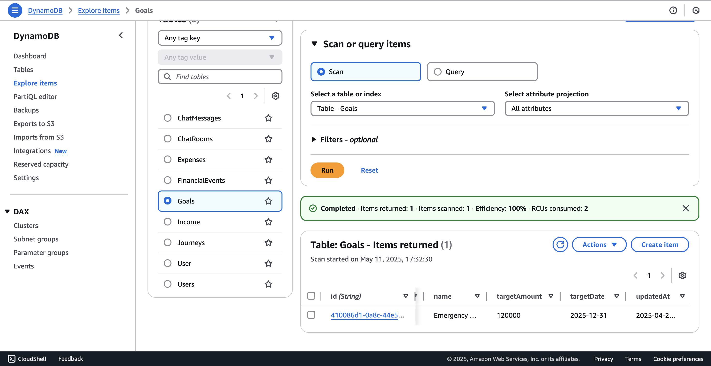
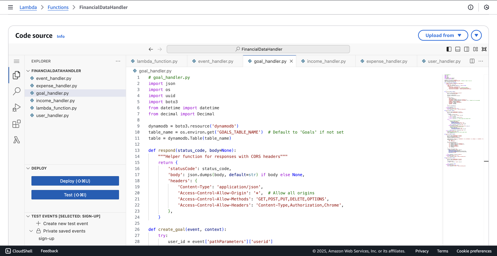
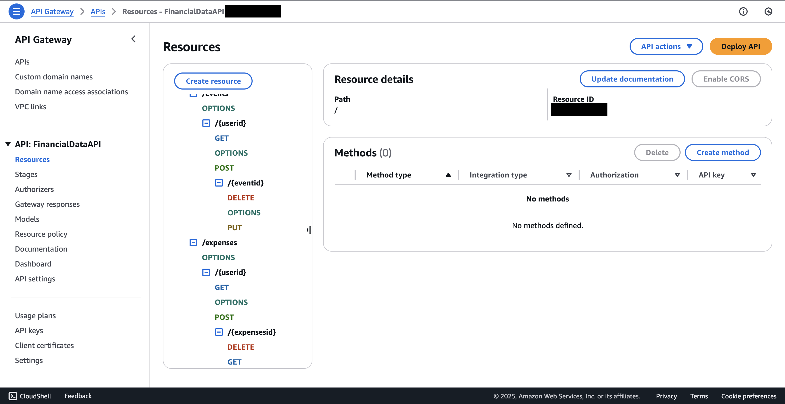

# FinFlow Harmony

<div align="center">
  
  <p><em>Smart financial management with the 50/30/20 rule</em></p>
</div>

## 📊 Project Overview

**FinFlow Harmony** is a comprehensive financial management application designed to help users track their expenses, save for goals, and make smarter financial decisions. The app implements the popular 50/30/20 budgeting strategy, automatically allocating funds for essentials (50%), personal spending (30%), and savings/goals (20%).

This project was primarily built to explore and learn AWS cloud services while creating a practical solution for personal finance management.

### Key Features

- **Smart Balance Allocation**: Automatically divides your balance using the 50/30/20 algorithm
- **Goal Tracking**: Set financial goals with target amounts and deadlines
- **Transaction Management**: Add, edit, and categorize income and expenses
- **Event Calendar**: Plan for upcoming financial events and expenses
- **Visual Analytics**: View your spending patterns with custom date ranges
- **Responsive Dashboard**: Get a complete overview of your financial health

## 🖼️ Screenshots

<div align="center">
  <table>
    <tr>
      <td></td>
      <td></td>
    </tr>
    <tr>
      <td></td>
      <td></td>
    </tr>
    <tr>
      <td></td>
      <td></td>
    </tr>
  </table>
</div>

## 🛠️ Tech Stack

### Frontend
- **React** + **TypeScript** for robust UI development
- **Tailwind CSS** for responsive styling
- **shadcn/ui** components for consistent design
- **Axios** for API communication

### Backend (Serverless)
- **AWS Lambda** with Python runtime
- **Amazon API Gateway** (REST API)
- **Amazon DynamoDB** (NoSQL database)
- **AWS Amplify** for hosting

### Infrastructure
<div align="center">
  <table>
    <tr>
      <td></td>
      <td></td>
      <td></td>
    </tr>
  </table>
</div>

## 🏗️ Architecture

FinFlow Harmony uses a modern serverless architecture:

```
┌─────────────┐     ┌─────────────┐     ┌─────────────┐     ┌─────────────┐
│             │     │             │     │             │     │             │
│  React App  │────▶│ API Gateway │────▶│   Lambda    │────▶│  DynamoDB   │
│             │     │             │     │  Functions  │     │             │
└─────────────┘     └─────────────┘     └─────────────┘     └─────────────┘
       ▲                                       │
       │                                       │
       └───────────────────────────────────────┘
```

### Database Schema

DynamoDB tables:
- **users**: User profiles and settings
- **income**: Income transactions
- **expense**: Expense transactions
- **goals**: Financial goals with target amounts and dates
- **events**: Calendar events for financial planning

## 💡 Key Features Explained

### 50/30/20 Budget Algorithm

The application implements the 50/30/20 budgeting rule:
- 50% for necessities (rent, bills, groceries)
- 30% for wants (entertainment, dining out)
- 20% for savings and debt repayment

The app automatically calculates these allocations based on the user's income and provides guidance on spending in each category.

### Goal-Based Saving

Users can set specific financial goals with:
- Target amount
- Deadline date
- Category and description
- Automatic calculation of required monthly contributions

### Analytics Engine

The analytics component offers:
- Monthly spending breakdowns
- Category-based expense analysis
- Custom date range reporting
- Income vs. expense comparisons

## 🚀 Getting Started

### Prerequisites
- Node.js (v14+)
- AWS account with appropriate permissions
- AWS CLI configured locally

### Installation

1. Clone the repository
```bash
git clone https://github.com/RonitNaik122/Cloud-Finance-Manager.git
cd finflow-harmony
```

2. Install dependencies
```bash
npm install
```

3. Start the development server
```bash
npm start
```

### Deployment

This application is configured for deployment on AWS Amplify:

1. Initialize Amplify
```bash
amplify init
```

2. Deploy the application
```bash
amplify publish
```

## 🔮 Future Enhancements

- [ ] Automated transaction import from banks
- [ ] Bill payment reminders and notifications
- [ ] Investment tracking and recommendations
- [ ] Machine learning for spending pattern analysis
- [ ] Mobile application support

## 🙏 Acknowledgements

- This project was created as a learning exercise for AWS cloud services
- Design inspiration from modern finance applications
- All financial data is manually entered and stored securely in DynamoDB

---

<div align="center">
  <p>Developed with ❤️ by Ronit Naik</p>
  <p>Connect with me on <a href="https://www.linkedin.com/in/ronit-naik-0810j06">LinkedIn</a> | <a href="https://github.com/RonitNaik122">GitHub</a></p>
</div>